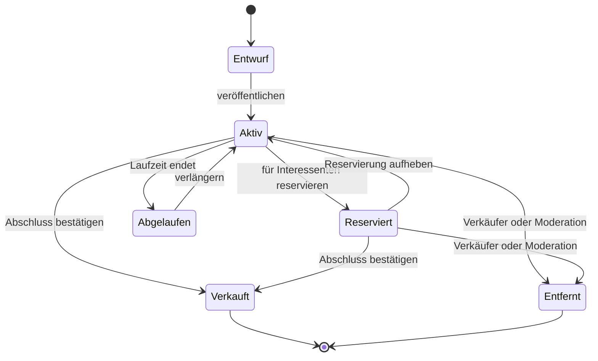

# CityMarkt – Ingame-Kleinanzeigen für FiveM

## Produktidee

`CityMarkt` ist eine eigenständige Kleinanzeigen-App für `sky_phone`. Spieler entdecken lokale
Angebote, veröffentlichen eigene Inserate, speichern Favoriten und verhandeln in privaten,
inseratsbezogenen Chats. Der eigentliche Austausch findet anschließend als Rollenspiel in der
Spielwelt statt.

Das Vorbild ist das vertraute Prinzip eines lokalen Anzeigenmarkts. Name, Marke, Oberfläche,
Symbole und Texte sind eigenständig und übernehmen weder eBay- noch Kleinanzeigen-Markenbestandteile.

## Ziele

- Handel zwischen Spielern sichtbar und einfach machen, ohne das Rollenspiel zu ersetzen.
- Fahrzeuge, Gegenstände, Dienstleistungen und Gesuche in einer gemeinsamen App auffindbar machen.
- Verhandlungen direkt mit dem jeweiligen Inserat verbinden.
- Inserate und Chats bei einem Gerätewechsel über das iFruit-Konto erhalten.
- Eine sichere technische Grundlage für spätere Erweiterungen wie Bewertungen oder Treuhandhandel
  schaffen.

## Bewusste Abgrenzung

Die erste Version ist kein Webshop und kein Auktionshaus:

- Es gibt keinen Sofortkauf und keine Gebote.
- CityMarkt zieht kein Geld ein und überträgt keine Items, Fahrzeuge oder Immobilien.
- Eine Reservierung ist nur eine sichtbare Absprache und keine Eigentumsübertragung.
- Verkäufer markieren den Abschluss nach der Übergabe selbst.
- Verbotene Waren und servereigene Regeln werden konfiguriert, nicht durch CityMarkt erfunden.

Damit bleibt die Übergabe ein RP-Moment und die App benötigt in der ersten Version keine tiefen,
fehleranfälligen Integrationen in Inventar-, Banking-, Fahrzeug- oder Housing-Ressourcen.

## App-Identität

- Arbeitstitel und Anzeigename: `CityMarkt`
- App-ID: `citymarkt`
- Technischer Bereich: `marketplace`
- Datenbesitz: iFruit-Konto
- Voraussetzung zum Veröffentlichen, Favorisieren oder Schreiben: angemeldetes iFruit-Konto
- Lesen öffentlicher Inserate: auch ohne Anmeldung möglich
- Stil: moderner lokaler Marktplatz mit warmem Gelb, dunklem Anthrazit und klaren Produktfotos
- Icon-Idee: vereinfachtes gelbes Preisschild vor einer dunklen Stadtsilhouette, ohne fremde Logos

## Nutzerrollen

### Besucher

Ein Besucher kann aktive Inserate durchsuchen und öffnen. Für Favoriten, Nachrichten oder eigene
Inserate fordert die App die Anmeldung bei einem iFruit-Konto an.

### Interessent

Ein angemeldeter Spieler kann Inserate speichern, dem Verkäufer schreiben, ein Treffen
vereinbaren, Verkäufer blockieren und problematische Inhalte melden.

### Verkäufer

Ein Verkäufer verwaltet seine eigenen Inserate, beantwortet Anfragen und setzt deren Status auf
reserviert, verkauft oder wieder verfügbar.

### Moderator

Ein Moderator kann gemeldete Inserate prüfen, ausblenden, entfernen und Konten zeitweise oder
dauerhaft vom Veröffentlichen ausschließen. Diese Funktionen liegen serverseitig und werden nicht
durch versteckte NUI-Berechtigungen abgesichert.

## Hauptnavigation

Die App besitzt fünf feste Bereiche:

1. **Entdecken** – neue, beliebte und zur Suche passende Angebote.
2. **Suchen** – Volltextsuche, Kategorien, Filter und Sortierung.
3. **Verkaufen** – mehrstufiger Assistent zum Erstellen eines Inserats.
4. **Nachrichten** – private Anfragen, immer mit sichtbarem Bezug zum Inserat.
5. **Mein Bereich** – eigene Inserate, Favoriten, Profil, Blockierungen und Einstellungen.

## Startseite „Entdecken“

Die Startseite soll auf dem kleinen Phone-Display schnell erfassbar sein:

- große Suchleiste im oberen Bereich
- horizontal scrollbare Kategorien
- Bereich „Neu in der Stadt“
- optionaler Bereich „In deiner Nähe“, jedoch nur nach Stadtteil und nie mit Live-Koordinaten
- kompakte Karten mit Titelbild, Preis, Titel, Stadtteil und Veröffentlichungszeit
- Status-Chip für `VB`, `Zu verschenken` oder `Reserviert`
- Skeleton-Zustand während des Ladens und klare Leer-/Fehlerzustände
- Cursor-basierte Seitennavigation statt Laden aller Inserate auf einmal

## Kategorien

Die Kategorien sind vollständig konfigurierbar. Ein sinnvoller Standard ist:

- Fahrzeuge
- Immobilien
- Elektronik
- Kleidung
- Werkzeuge und Zubehör
- Freizeit und Sammlerstücke
- Dienstleistungen
- Jobs und Aufträge
- Gesuche
- Sonstiges

Illegale Angebote sollten nicht stillschweigend in den normalen Markt gemischt werden. Falls der
Server sie als RP-Feature wünscht, ist später ein separat konfigurierbarer, zugangsbeschränkter
Markt die sauberere Lösung.

## Suche und Filter

Die Suche arbeitet serverseitig und unterstützt:

- Suchtext in Titel und Beschreibung
- Kategorie und Unterkategorie
- Mindest- und Höchstpreis
- Preisart: Festpreis, Verhandlungsbasis oder kostenlos
- Zustand: neu, sehr gut, gebraucht oder defekt
- Stadtteil
- nur Inserate mit Bildern
- Sortierung nach Neueste, Preis aufsteigend und Preis absteigend

Filter bleiben während einer App-Sitzung erhalten. Ein Filter-Chip zeigt sichtbar, wenn die Liste
nicht ungefiltert ist.

## Inserat erstellen

Der Verkaufsassistent besteht aus vier kurzen Schritten:

### 1. Bilder

- ein bis sechs Bilder aus der Phone-Fotoauswahl
- erstes Bild ist das Titelbild
- Reihenfolge per Drag-and-drop oder Pfeiltasten änderbar
- Bild entfernen und neues Titelbild wählen
- keine Base64-Bilder in der Datenbank; gespeichert werden validierte Referenzen auf Phone-Medien

### 2. Details

- Titel mit 5 bis 70 Zeichen
- Beschreibung mit 20 bis 2.000 Zeichen
- Kategorie und optionale Unterkategorie
- Zustand
- optionaler Stadtteil, aber keine exakte Position

### 3. Preis und Kontakt

- Preisart: Festpreis, Verhandlungsbasis oder kostenlos
- Preis nur bei Festpreis oder Verhandlungsbasis
- Kontakt über CityMarkt-Anfrage als Standard
- Telefonnummer optional anzeigen
- konfigurierbare Laufzeit, standardmäßig sieben Tage

### 4. Vorschau

- vollständige Vorschau wie auf der Detailseite
- Hinweise auf fehlende Pflichtangaben
- Veröffentlichung erst nach serverseitiger Validierung
- Erfolgseffekt mit kurzer Animation und dezentem Ton

Entwürfe werden als Cloud Data gespeichert. Dadurch geht ein angefangener Eintrag beim Wechsel des
Geräts nicht verloren.

## Inseratsdetail

Die Detailseite enthält:

- swipebare Bildergalerie mit Bildzähler
- Preis und Preisart
- Titel, Zustand, Stadtteil und Erstellungszeit
- vollständige Beschreibung
- Verkäuferkarte mit Anzeigename, Mitglied-seit-Datum und Anzahl aktiver Inserate
- Buttons für Favorit, Teilen innerhalb des Phones, Melden und Blockieren
- hervorgehobenen Button „Nachricht schreiben“
- bei eigenen Inseraten stattdessen die Aktionen Bearbeiten, Reservieren, Verkauft und Löschen

Ein Teilen-Link ist eine interne, nicht erratbare Inseratsreferenz. Er enthält weder HTML noch
Spieler-, Konto- oder Positionsdaten.

## Nachrichten und Verhandlung

Jede Inquiry gehört genau zu einem Inserat, einem Verkäufer und einem Interessenten. Im Kopf des
Chats bleiben Titelbild, Titel, aktueller Preis und Status sichtbar. So ist auch bei mehreren
Verhandlungen eindeutig, worüber gesprochen wird.

Funktionen der ersten Version:

- Textnachrichten
- schnelle Vorschläge wie „Ist das noch verfügbar?“ und „Wo können wir uns treffen?“
- ungelesene Nachrichten und App-Badge
- Push-Benachrichtigung auf allen aktiven Geräten des iFruit-Kontos
- Gespräch stummschalten
- Nutzer blockieren und Gespräch melden
- Hinweis, wenn Preis oder Status nach Gesprächsbeginn geändert wurde

Das bestehende Mail-System wird nicht als Chat-Datenbank missbraucht. CityMarkt-Unterhaltungen
haben eine eigene fachliche Bedeutung, eigene Berechtigungen und eigene Aufbewahrungsregeln.

## Statusmodell

Nur aktive Inserate erscheinen regulär in Suche und Entdecken. Reservierte Inserate bleiben
sichtbar, sind aber eindeutig gekennzeichnet. Verkaufte, abgelaufene und entfernte Inserate bleiben
für Eigentümer und Moderation nachvollziehbar.

## Reservierung und Abschluss

- Nur der Verkäufer kann ein Inserat reservieren oder als verkauft markieren.
- Eine Reservierung kann genau einer Inquiry beziehungsweise einem Interessenten zugeordnet sein.
- Der Interessent erhält eine Benachrichtigung über Reservierung oder Aufhebung.
- Andere Interessenten sehen nur den Status, niemals die Identität des Reservierten.
- Der Abschluss speichert keine behaupteten Geld- oder Itemdaten.
- Eine spätere automatische Handelsfunktion wäre ein eigenes Modul mit Server-Authority,
  transaktionaler Zahlung und expliziten Adaptern pro Fremdressource.

## Favoriten und Beobachtung

Favoriten sind privat und an das iFruit-Konto gebunden. In der ersten Version informieren sie über:

- eine Preisänderung
- eine aufgehobene Reservierung
- das baldige Ablaufen

Ein Verkäufer sieht keine Liste der Konten, die sein Inserat gespeichert haben. Optional kann nur
eine aggregierte Anzahl angezeigt werden.

## Verkäuferprofil und Vertrauen

Das MVP zeigt bewusst wenige, schwer manipulierbare Angaben:

- gewählter CityMarkt-Anzeigename
- Mitglied seit
- Anzahl aktiver Inserate
- Anzahl abgeschlossener Inserate

Sternebewertungen sind nicht Teil des MVP. Ohne verifizierten automatischen Handel lassen sie sich
leicht durch Zweitkonten manipulieren. Eine spätere Bewertung darf deshalb nur nach einer
Reservierung plus beidseitig bestätigtem Abschluss möglich sein.

## Moderation und Missbrauchsschutz

### Nutzerfunktionen

- Inserat mit Grund und optionaler Beschreibung melden
- Verkäufer blockieren
- eigene Meldungen nicht mehrfach senden
- blockierte Konten aus Nachrichten und personalisierten Listen ausblenden

### Moderationsfunktionen

- Warteschlange offener Meldungen
- Inserat ausblenden, entfernen oder wiederherstellen
- Veröffentlichungs- oder Nachrichtensperre pro iFruit-Konto
- interne Notiz und nachvollziehbarer Audit-Eintrag
- konfigurierbare Kategorien, Begriffe, Limits, Gebühren und Laufzeiten

### Technischer Schutz

- Konto, Eigentümer und Berechtigungen immer aus der serverseitigen Phone-Sitzung bestimmen
- Preis, Status, Verkäufer-ID und Empfänger niemals aus NUI-Daten übernehmen
- erlaubte Statusübergänge auf dem Server prüfen
- Längen, Typen, Kategorie, Preisbereich, Bildanzahl und Bildbesitz validieren
- SQL ausschließlich parametrisiert ausführen
- Titel und Beschreibungen nur als Text rendern; kein ungefiltertes HTML
- Ratenlimits für Erstellen, Bearbeiten, Suchen, Nachrichten und Meldungen
- Duplikat- und Spam-Erkennung mit sichtbarer, lokalisierter Fehlermeldung
- konfliktfeste Änderungen über Revisionsnummer oder `updated_at`
- Audit-Daten nur serverseitig und ohne sensible Inhalte im Client

## Datenschutz im Rollenspiel

- CityMarkt veröffentlicht nie Player-ID, Framework-Identifier, IMEI oder iFruit-Konto-ID.
- Ein Stadtteil ist optional; genaue Koordinaten und Live-Positionen sind ausgeschlossen.
- Telefonnummern sind nur sichtbar, wenn der Verkäufer dies pro Inserat aktiviert.
- Blockierte Konten können keine neue Inquiry miteinander beginnen.
- Gelöschte Chat-Ansichten und serverseitige Moderationsaufbewahrung sind getrennte Vorgänge.

## Fachliches Datenmodell

### Listing

Besitzt Verkäuferkonto, Titel, Beschreibung, Kategorie, Zustand, Preisart, optionalen Preis,
Stadtteil, Status, Laufzeit, Revision und Zeitstempel.

### ListingImage

Verknüpft eine validierte Phone-Medienreferenz mit einem Inserat und einer festen Sortierposition.

### Favorite

Verknüpft ein iFruit-Konto privat und eindeutig mit einem Inserat.

### Inquiry

Verknüpft ein Inserat, den Verkäufer und genau einen Interessenten. Pro Interessent und Inserat
existiert höchstens eine aktive Inquiry.

### InquiryMessage

Enthält Absenderkonto, Text, Versandzeit und optionalen Lesezeitpunkt innerhalb einer Inquiry.

### Reservation

Verknüpft ein Inserat zeitweise mit einer Inquiry. Sie dokumentiert eine Absicht, aber keinen Kauf.

### Report

Enthält meldendes Konto, Ziel, Grund, Moderationsstatus und Audit-Zeitpunkte.

### Block

Verhindert direkte CityMarkt-Interaktionen zwischen dem blockierenden und dem blockierten Konto.

## Vorgeschlagene Tabellen

Alle Tabellen gehören ausschließlich `sky_phone`:

- `sky_phone_marketplace_listings`
- `sky_phone_marketplace_images`
- `sky_phone_marketplace_favorites`
- `sky_phone_marketplace_inquiries`
- `sky_phone_marketplace_messages`
- `sky_phone_marketplace_reservations`
- `sky_phone_marketplace_reports`
- `sky_phone_marketplace_blocks`
- `sky_phone_marketplace_audit`

Fremdschlüssel zeigen auf `sky_phone_accounts.id`, wo Kontobesitz erforderlich ist. Öffentliche IDs
sollten nicht direkt die fortlaufenden Datenbank-IDs offenlegen.

## Technischer Schnitt

Die App wird als eigener Bereich in Frontend, Client und Server umgesetzt. Sie greift weder auf
`sky_base` noch auf andere `sky_*`-Ressourcen zu.

Vorgesehene NUI-Aktionen:

- `marketplace:list`
- `marketplace:get`
- `marketplace:create`
- `marketplace:update`
- `marketplace:set-status`
- `marketplace:favorite`
- `marketplace:list-own`
- `marketplace:list-inquiries`
- `marketplace:get-inquiry`
- `marketplace:send-message`
- `marketplace:report`
- `marketplace:block`

Die Client-Schicht leitet Anfragen in den Namespace `sky_phone:marketplace:*` weiter. Jeder
erreichbare NUI-Pfad beantwortet seinen Callback. Der Server liefert Listen paginiert und nur mit
den Feldern aus, die die aktuelle Ansicht benötigt.

## Benachrichtigungen

CityMarkt verwendet das bestehende Phone-Benachrichtigungssystem für:

- neue Inquiry
- neue Nachricht
- Reservierung oder aufgehobene Reservierung
- Preis- oder Statusänderung eines Favoriten
- Ablaufhinweis für ein eigenes Inserat
- Ergebnis einer Moderationsmeldung

Der Benachrichtigungstext wird lokalisiert. App-Badge und ungelesene Anzahl werden serverseitig aus
dem Konto abgeleitet und auf dessen aktive Geräte synchronisiert.

## Konfiguration

Administratoren sollen ohne Codeänderung festlegen können:

- aktivierte Kategorien und Unterkategorien
- maximal aktive Inserate pro Konto
- Bild-, Text- und Preislimits
- Laufzeit und Verlängerungsregeln
- Veröffentlichungsgebühr, standardmäßig deaktiviert
- erlaubte Stadtteile
- Meldegründe und Moderationsrollen
- Ratenlimits und Sperrdauern
- optional sichtbare Telefonnummern

Eine Gebühr wird erst umgesetzt, wenn der Phone-eigene Framework-Bridge-Pfad eine serverseitige,
nachweisbar erfolgreiche Abbuchung unterstützt. Der Client darf niemals eine erfolgreiche Zahlung
behaupten.

## MVP-Umfang

Die erste veröffentlichbare Version enthält:

- App-Icon, Navigation und vollständig lokalisierte Oberfläche
- öffentliche Suche, Filter, Liste und Detailansicht
- Konto-Pflicht für schreibende Aktionen
- Inserat erstellen, bearbeiten, verlängern, reservieren, verkaufen und entfernen
- bis zu sechs Bilder aus der Phone-Fotoauswahl
- Favoriten
- inseratsbezogene Einzelchats und Benachrichtigungen
- Melden, Blockieren und serverseitige Moderationsgrundlage
- paginierte Datenbankabfragen und vollständige Servervalidierung
- Browser-Mockdaten zum Testen der Oberfläche ohne laufenden FiveM-Server

## Spätere Ausbaustufen

1. verifizierte Verkäuferprofile und belastbare Bewertungen
2. gespeicherte Suchen mit Benachrichtigungen
3. bezahlte, klar markierte Hervorhebungen
4. organisationsbezogene Händlerprofile
5. separater, konfigurierbarer Schwarzmarkt mit eigenem Zugangskonzept
6. serverautoritatives Treuhand-Modul mit expliziten Banking-/Inventar-Adaptern

Automatische Eigentumsübertragung, Auktionen und Lieferaufträge gehören nicht in das MVP, weil sie
weitere Domänen und Fremdressourcen koppeln würden.

## Umsetzungsetappen

### Etappe 1 – Fundament

- Schema und Migrationen
- Konfiguration und Lokalisierung
- App-Registrierung, Icon, Routing und Browser-Mocks
- Lesen, Suchen, Filtern und Detailansicht

### Etappe 2 – Verkaufen

- Medienauswahl
- Erstellungsassistent
- eigene Inserate und Statuswechsel
- Ablauf und Verlängerung

### Etappe 3 – Kommunikation

- Inquiries und Nachrichten
- Benachrichtigungen und Badge
- Favoriten und Änderungsinformationen

### Etappe 4 – Sicherheit und Moderation

- Blockieren und Melden
- Moderationsaktionen und Audit
- Last-, Spam-, Konflikt- und Berechtigungstests

## Abnahmekriterien

- Ein nicht angemeldeter Nutzer kann suchen, aber keine schreibende Aktion ausführen.
- Ein angemeldeter Nutzer kann nur eigene Inserate ändern oder deren Status setzen.
- Manipulierte Verkäufer-, Preis-, Empfänger- oder Statusdaten aus der NUI werden abgewiesen.
- Alle Statuswechsel entsprechen dem definierten Statusmodell.
- Abgelaufene oder entfernte Inserate erscheinen nicht in der öffentlichen Suche.
- Reservierungen zeigen öffentlich keine Identität des Interessenten.
- Eine Inquiry ist ausschließlich für ihre zwei beteiligten Konten sichtbar.
- Blockierte Konten können keine neue Inquiry eröffnen oder Nachrichten senden.
- Bildreferenzen werden auf Existenz, Besitz, Typ und Anzahl geprüft.
- Suche und Listen funktionieren stabil mit Cursor-Paginierung und gleichzeitig neuen Inseraten.
- Texte können weder HTML noch Skripte in die Oberfläche einschleusen.
- Inserate, Favoriten und Chats erscheinen auf allen Geräten desselben iFruit-Kontos.
- Alle sichtbaren Texte sind lokalisiert und alle NUI-Callbacks antworten auf jedem Pfad.
- Die Oberfläche passt ohne horizontales Abschneiden in die vorhandene Phone-Auflösung.

## Noch vor der Umsetzung festzulegen

Die empfohlenen Standardentscheidungen sind bereits oben beschrieben. Vor der späteren
Implementierung sollten nur noch diese Serverregeln bestätigt werden:

- endgültige Kategorien und erlaubte Waren
- ob Telefonnummern standardmäßig verborgen bleiben
- ob Veröffentlichung kostenlos bleibt
- Laufzeit und maximales Inseratslimit
- welche Serverrolle moderieren darf
