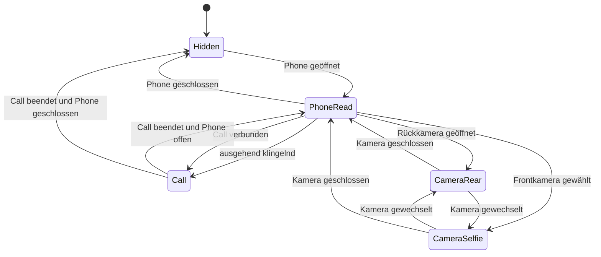

# Konzept: Phone-Animationen und sichtbares Handy-Prop

Stand: `dev` auf Commit `213042c` (2026-08-08)

## 1. Ergebnis der Bestandsaufnahme

Die funktionalen Abläufe für das Öffnen des Phones, Telefonate und die Kamera sind vorhanden. Eine physische Darstellung am Spieler fehlt jedoch vollständig:

- Es gibt aktuell kein `RequestAnimDict`, `TaskPlayAnim` oder `StopAnimTask` im Phone-Client.
- Es gibt aktuell kein Phone-Objekt, kein `CreateObject`, kein `AttachEntityToEntity` und keinen Prop-Cleanup.
- `source/client/main.lua` verwaltet Phone-Öffnung, NUI-Fokus, eingehende Anrufe und den pma-voice-Call-Channel.
- `source/client/camera.lua` verwaltet First-Person-, Front- und Ultrawide-Kameras, Blitz, Fokus sowie den Kamera-Cleanup.
- `frontend/src/stores/calls.ts` hält den sichtbaren Call-State. Terminale Zustände bleiben dort noch 1,6 Sekunden sichtbar.
- Ein eingehender Anruf öffnet serverseitig das konkrete Gerät über `SkyPhone.OpenDeviceForCall`, bevor `sky_phone:call:incoming` gesendet wird.

In der Git-Historie existierte kurz ein Selfie-Versuch (`ecbf5d8`) über die externe Ressource `rpemotes` und den Emote-Namen `malemirrorselfie3`. Die Änderung wurde direkt danach mit den Kamera-Screen-Fixes `7cc19ff` und `4461246` entfernt. Diese Abhängigkeit soll nicht zurückkehren: `sky_phone` soll seine Animationen und Props selbst besitzen.

## 2. Zielbild

Der Spieler soll das Handy für andere Spieler nachvollziehbar in der Hand halten und je nach tatsächlicher Nutzung die passende Oberkörperanimation zeigen:

1. Phone geöffnet: Handy vor dem Körper, lesend/tippend.
2. Ausgehender oder verbundener Anruf: Handy am Ohr.
3. Eingehender, noch nicht angenommener Anruf: Handy sichtbar in der Hand, aber noch nicht am Ohr.
4. Rückkamera: Handy wie zum Fotografieren/Filmen gehalten.
5. Frontkamera: ausgestreckter Arm in Selfie-Haltung.
6. Landschaftsmodus: Prop und Pose folgen der horizontalen Geräteausrichtung.
7. Schließen oder Ende der letzten aktiven Nutzung: saubere Ausblend-/Wegsteckanimation und garantierter Cleanup.

Die Animationen sind rein clientseitige Darstellung. Call-Berechtigung, Gerätebesitz, Medien-Uploads und Voice bleiben unverändert serverautoritativ.

## 3. Architektur

### 3.1 Zentraler Animationscontroller

Neue Datei: `sky_phone/source/client/animations.lua`

Nur dieser Controller darf Phone-Prop und Phone-Animation besitzen. `main.lua` und `camera.lua` melden ausschließlich Zustandsänderungen. Dadurch entstehen weder doppelte Props noch konkurrierende Cleanup-Pfade.

Interner Controller-State:

```lua
local animation_state = {
    phone_open = false,
    call_state = nil,
    call_direction = nil,
    camera_active = false,
    camera_front = false,
    camera_landscape = false,
    current_mode = "hidden",
    prop = nil,
    ped = nil,
    revision = 0,
}
```

Die `revision` macht Übergänge abbrechbar: Wenn während einer Einblendanimation bereits ein Anruf verbunden wird oder die Kamera öffnet, darf der veraltete Ablauf nicht später wieder die Texting-Pose setzen.

### 3.2 Ereignisse zwischen den Client-Dateien

Vorgesehene lokale Events:

- `sky_phone:animation:phone` mit `true/false`
- `sky_phone:animation:call` mit Call-State und Richtung
- `sky_phone:animation:camera` mit aktiv, Frontkamera und Ausrichtung
- `sky_phone:animation:reset` für sofortigen Cleanup

Es sind lokale `TriggerEvent`-Aufrufe, keine Net-Events. Es werden keine neuen Server-Endpunkte und keine öffentlichen Exports benötigt.

### 3.3 Priorität der Zustände

Die sichtbare Pose wird immer aus allen Teilzuständen abgeleitet, nicht direkt von einem einzelnen UI-Event gesetzt:

| Priorität | Bedingung | Modus |
|---:|---|---|
| 1 | Call `connected` | `call` |
| 2 | ausgehender Call `ringing` | `call` |
| 3 | Kamera aktiv, Frontkamera | `camera_selfie` |
| 4 | Kamera aktiv, Rückkamera | `camera_rear` |
| 5 | eingehender Call `ringing` | `phone_read` |
| 6 | Phone geöffnet | `phone_read` |
| 7 | nichts davon | `hidden` |

Damit bleibt das Handy bei einem geschlossenen NUI während eines laufenden Gesprächs am Ohr. Ein Kamera-Unmount kann umgekehrt keinen aktiven Call versehentlich ausblenden.



## 4. Prop-Konzept

### 4.1 Modell und Attachment

Empfohlener Ausgangspunkt:

- Modell: `prop_npc_phone_02`
- Hash: immer `joaat("prop_npc_phone_02")`
- Hand-Bone: `28422`
- Erstellung: netzwerksynchrones Mission-Objekt, damit andere Spieler das Handy sehen
- Kollision: aus
- Soft-Pinning: aus
- Rotation synchronisieren: an

Das Objekt wird erst nach erfolgreich geladenem Modell erzeugt. Modell-Ladefehler werden auf Englisch sichtbar geloggt; sie werden nicht still durch ein anderes Modell kaschiert.

### 4.2 Transform-Profile

Offsets und Rotationen gehören konfigurierbar in ein Phone-eigenes Animationsprofil:

- `phone_read_portrait`
- `call_portrait`
- `camera_rear_portrait`
- `camera_rear_landscape`
- `camera_selfie_portrait`
- `camera_selfie_landscape`

Für Texting und Call sind Position/Rotation `0.0` ein sinnvoller erster GTA-Standardwert. Kamera- und Landscape-Profile müssen im Spiel mit männlichen und weiblichen Freemode-Peds kalibriert werden. Ungeprüfte Winkel sollen nicht als endgültige Werte festgeschrieben werden.

### 4.3 Lebenszyklus

1. Modell anfordern und mit begrenzter Ladezeit warten.
2. Prop einmalig erstellen.
3. Mit expliziten Einzelkoordinaten an die Hand hängen; OAL erlaubt kein implizites `vector3`-Unpacking.
4. Bei Moduswechsel nur Transform und Animation wechseln, nicht das Objekt neu erstellen.
5. Beim normalen Schließen nach der Out-Animation löschen.
6. Bei Resource-Stop, Tod, Ped-Wechsel oder Invalidierung sofort lösen und löschen.
7. Das Handle erst nach erfolgreichem Löschen auf `nil` setzen.

## 5. Animationskatalog

Die folgenden GTA-Clips sind die Implementierungsbasis. Die Clipnamen müssen im vorgesehenen Ingame-Kalibrierungstest auf dem eingesetzten Game-Build final bestätigt werden; FiveM dokumentiert Native-Signaturen, aber nicht zuverlässig den vollständigen Bestand aller GTA-Animationsclips.

| Zweck | Dictionary | Clip | Verwendung |
|---|---|---|---|
| Phone hervorholen | `cellphone@` | `cellphone_text_in` | Übergang `hidden -> phone_read` |
| Phone lesen/tippen | `cellphone@` | `cellphone_text_read_base` | loopende Standardpose |
| Phone wegstecken | `cellphone@` | `cellphone_text_out` | Übergang `phone_read -> hidden` |
| Hand zum Ohr | `cellphone@` | `cellphone_text_to_call` | Übergang `phone_read -> call` |
| Telefonieren | `cellphone@` | `cellphone_call_listen_base` | loopende Call-Pose |
| Vom Ohr zur Hand | `cellphone@` | `cellphone_call_to_text` | Übergang `call -> phone_read` |
| Call direkt beenden | `cellphone@` | `cellphone_call_out` | Übergang `call -> hidden` |
| Selfie | `anim@mp_player_intuppertake_selfie` | `idle_a` | Ausgangspunkt für Frontkamera |
| Rückkamera | `cellphone@` | `cellphone_text_read_base` | Ausgangspunkt; im Spiel auf Kamerahaltung prüfen |

Für Fahrzeuge werden die GTA-eigenen In-Car-Varianten geprüft:

- Fahrer: `anim@cellphone@in_car@ds`
- Beifahrer: `anim@cellphone@in_car@ps`

Die Clipnamen entsprechen möglichst den oben genannten Phone-Clips. Falls ein benötigter Clip in einer Fahrzeugvariante nicht existiert, wird das vor der Implementierung über den Test-Harness geklärt. Es soll keine stille Laufzeit-Fallback-Kette geben.

### 5.1 Animationsflags

Loopende Posen sollen nur den Oberkörper als Secondary Task belegen und Bewegung zulassen. Vorgesehene Flag-Kombination:

- Looping `1`
- Upper body `16`
- Secondary task `32`
- Summe für Base-Posen: `49`

Übergangsclips werden ebenfalls nur auf dem Oberkörper abgespielt, aber ohne Loop. Der Controller beendet ausschließlich den eigenen konkreten Clip mit `StopAnimTask`; `ClearPedTasks` und `ClearPedTasksImmediately` sind ausgeschlossen, weil sie fremde Emotes, Verletzungsanimationen oder Gameplay-Tasks zerstören würden.

## 6. Übergänge im Detail

| Von | Nach | Ablauf |
|---|---|---|
| `hidden` | `phone_read` | Prop erzeugen/anhängen, `cellphone_text_in`, anschließend Read-Loop |
| `phone_read` | `call` | `cellphone_text_to_call`, anschließend Call-Loop |
| `call` | `phone_read` | `cellphone_call_to_text`, anschließend Read-Loop |
| `phone_read` | `hidden` | `cellphone_text_out`, dann Prop löschen |
| `call` | `hidden` | `cellphone_call_out`, dann Prop löschen |
| `phone_read` | Kameramodus | Read-Clip sauber stoppen, Kamera-Pose starten, Prop-Transform wechseln |
| Kameramodus | `phone_read` | Kamera-Pose stoppen, Portrait-Transform und Read-Loop setzen |
| Rückkamera | Selfie | Prop-Transform und Pose atomar wechseln |
| Portrait | Landscape | nur das aktive Kamera-Transformprofil wechseln; kein Prop-Neuspawn |

Die Dauer eines Übergangs soll aus `GetAnimDuration` gelesen und nicht als frei erfundener `Wait` fest verdrahtet werden. Ein kurzer Controller-Thread wartet auf das Ende, prüft dabei die `revision` und setzt nur dann die vorgesehene Base-Pose.

## 7. Integration in die vorhandenen Abläufe

### `source/client/main.lua`

- Nach bestätigtem `ui:opened`: `phone_open = true` melden.
- In `close_phone`: `phone_open = false` melden, bevor NUI und Session geschlossen werden.
- Bei `sky_phone:device:invalidated`: sofortigen Reset auslösen.
- Bei `sky_phone:call:incoming`: Richtung und `ringing` melden.
- Bei `sky_phone:call:state`: jeden State an den Controller weiterreichen.
- Bei Resource-Stop: Controller-Reset vor Fokus- und Voice-Cleanup.

Wichtig: Der Animationscontroller darf nicht ausschließlich `is_open` beobachten. Calls können das Phone automatisch öffnen, und ein laufender Call muss auch nach manuellem Schließen des NUI sichtbar bleiben.

### `source/client/camera.lua`

- `camera:setActive` meldet Start/Ende.
- `camera:setFacing` meldet Front/Rückseite.
- Ein neuer Callback `camera:setOrientation` meldet Portrait/Landscape an Lua.
- Kamera-Cleanup meldet immer `active = false`, auch bei NUI-Close und Resource-Stop.
- Der bestehende Per-Frame-Kamera-Thread bleibt für HUD, scripted Cam und Blitz zuständig; Prop-/Animationslogik wird dort nicht dupliziert.

### `frontend/src/views/apps/CameraApp.vue`

- `toggleOrientation` sendet zusätzlich `nuiCall('camera:setOrientation', ...)`.
- Beim Mount wird Portrait initial synchronisiert.
- Beim Unmount wird Portrait zurückgesetzt, bevor die Kamera deaktiviert wird.

### `fxmanifest.lua`

- `source/client/animations.lua` vor `camera.lua` und `main.lua` laden.
- Keine neue externe Dependency hinzufügen.

## 8. Kamera-spezifische Anforderungen

### Rückkamera

- Der lokale Spieler nutzt weiterhin den vorhandenen First-Person-Game-View.
- Andere Spieler sehen Prop und Oberkörperpose.
- In Fahrzeugen wird die passende In-Car-Pose gewählt.
- Das Prop darf das lokale Capture-Bild nicht verdecken. Das wird im Kalibrierungstest mit 0.5x, 1x, 2x und 3x geprüft.

### Frontkamera

- Die vorhandene scripted Camera bleibt kopfbasiert.
- Die Selfie-Pose darf den Kopf nicht aus dem Bild drehen oder den Arm unnatürlich durch den Körper führen.
- Portrait und Landscape benötigen getrennte Prop-Rotationen.
- Das frühere `rpemotes`-Verhalten wird nicht verwendet, weil es den Kamera-Game-View bereits nachweislich störte und eine unerwünschte Pflichtabhängigkeit erzeugte.

### Foto und Video

Foto-Auslösung und laufende Videoaufnahme ändern den Animationsmodus nicht. Optionales kurzes Shutter-Feedback darf später als additive kleine Handbewegung ergänzt werden, darf aber den Capture-Zeitpunkt und die Media-Upload-State-Machine nicht blockieren.

## 9. Unterbrechungen und Edge-Cases

### Sofortiger Cleanup

- Resource wird gestoppt.
- Device wird invalidiert oder aus dem Inventar entfernt.
- Player-Ped stirbt oder existiert nicht mehr.
- Ped-Modell wird gewechselt und das alte Ped-Handle ist ungültig.

### Temporäres Pausieren mit anschließendem Neubewerten

- Ragdoll, Fallen, Klettern, Schwimmen oder Fallschirmzustand.
- Einstieg in oder Ausstieg aus einem Fahrzeug.
- Wechsel zwischen Fahrer- und Beifahrersitz.

Ein niedrigfrequenter Watcher läuft nur, solange ein sichtbarer Phone-Modus angefordert ist. Er erkennt Ped-/Fahrzeug-Kontextwechsel und setzt den abgeleiteten Modus neu. Es gibt keinen permanenten `Wait(0)`-Animationsloop.

### Konflikte mit anderen Animationen

- Phone verwendet Upper-Body/Secondary-Tasks.
- Cleanup stoppt nur bekannte Phone-Clips.
- Keine pauschalen Task-Clears.
- Keine Integration oder Zustandsabfrage gegen `rpemotes`.
- Wenn eine Gameplay-Animation Phone bewusst unterbricht, wird nicht pro Frame dagegen angekämpft.

### Call-Sonderfälle

- Ausgehend `ringing`: bereits am Ohr.
- Eingehend `ringing`: Phone in der Hand.
- `connected`: am Ohr, unabhängig von der Richtung.
- `busy`, `unavailable`, `declined`, `no_answer`, `cancelled`, `disconnected`, `sim_removed`, `completed`: zum offenen Phone zurück oder ausblenden.
- Der 1,6-Sekunden-Terminalscreen im Frontend beeinflusst die physische Pose nicht; die Pose folgt dem echten Call-State sofort.

## 10. Konfiguration

Empfohlener neuer Block in `config/config.lua`:

```lua
Config.Animations = {
    Enabled = true,
    PropModel = "prop_npc_phone_02",
    PropBone = 28422,
    LoadTimeoutMs = 5000,
    ContextPollMs = 500,
    Transforms = {
        -- Im Ingame-Kalibrierungsschritt final befüllen.
    },
}
```

Animation-Dictionaries und Clips können ebenfalls in diesem Block liegen, wenn Serverbetreiber sie bewusst austauschbar benötigen. Für den ersten Release ist eine phone-eigene, getestete Standardkonfiguration ausreichend. Es gibt keine neuen nutzersichtbaren Texte und damit keine Locale-Migration.

## 11. Verifizierte Native-Basis

Die Umsetzung stützt sich clientseitig auf die offiziellen FiveM-Natives:

- `RequestAnimDict`, `HasAnimDictLoaded`, `GetAnimDuration`
- `TaskPlayAnim`, `IsEntityPlayingAnim`, `StopAnimTask`
- `RequestModel`, `HasModelLoaded`, `SetModelAsNoLongerNeeded`
- `CreateObject`, `DoesEntityExist`, `DeleteEntity`
- `GetPedBoneIndex`, `AttachEntityToEntity`, `DetachEntity`

Referenzen:

- [FiveM Native Reference](https://docs.fivem.net/natives/)
- [FiveM: Understanding and Using Native Functions](https://docs.fivem.net/docs/scripting-manual/introduction/about-native-functions/)

Bei der Implementierung werden alle final verwendeten Signaturen nochmals direkt in der Native Reference geprüft. Wegen aktiviertem OAL werden Koordinaten immer als einzelne `x`, `y`, `z`-Argumente übergeben.

## 12. Umsetzungsreihenfolge

1. Phone-eigenen Animationscontroller und sicheren Prop-Lebenszyklus implementieren.
2. Öffnen/Schließen und Texting-Pose anbinden.
3. Call-State-Prioritäten und alle terminalen Call-Zustände anbinden.
4. Kamera Front/Rückseite sowie Portrait/Landscape anbinden.
5. In-Car-Dictionaries und Sitzwechsel ergänzen.
6. Entwicklungs-Harness zum manuellen Durchschalten aller Posen verwenden.
7. Transformwerte mit Freemode male/female kalibrieren.
8. Edge-Case-Matrix testen.
9. Frontend bauen und mit `build_frontend.bat` deployen; das Script führt anschließend automatisch `build_copy.bat` aus.

## 13. Abnahmematrix

### Standard

- Phone im Stand öffnen und schließen.
- Mit Phone gehen, rennen und stehen.
- Mehrfach schnell öffnen/schließen: niemals doppeltes oder liegengebliebenes Prop.
- Resource während geöffnetem Phone neu starten: Prop verschwindet.

### Calls

- Ausgehend: ringing, connected, hangup.
- Eingehend: ringing, answer, decline, no answer.
- Ziel nicht erreichbar und Ziel besetzt.
- SIM während des Calls entfernt.
- Phone-NUI während verbundenem Call geschlossen.
- Spieler verlässt den Server oder verliert das konkrete Device.

### Kamera

- Rückkamera mit 0.5x, 1x, 2x und 3x.
- Frontkamera mit 0.5x und 1x.
- Portrait/Landscape in beiden Kamerarichtungen.
- Foto, Video Start/Stop und Kamera-Unmount während Aufnahme.
- Kamera verlassen, direkt Call starten und umgekehrt.
- Prop/Arme dürfen das gespeicherte Bild nicht ungewollt verdecken.

### Ped und Fahrzeuge

- Freemode male und female.
- Fahrer, Beifahrer und Rücksitz.
- Ein-/Aussteigen bei geöffnetem Phone.
- Tod, Ragdoll, Schwimmen, Fallen und Ped-Wechsel.

### Multiplayer

- Zweiter Client sieht Animation und Prop korrekt.
- Kein doppeltes Prop nach Ownership-/Streaming-Wechsel.
- Prop verschwindet für andere Spieler bei Cleanup und Disconnect.

## 14. Definition of Done

- Genau ein zentraler Controller besitzt Animation und Prop.
- Alle Phone-, Call- und Kamera-Zustände ergeben deterministisch eine Pose.
- Das Prop ist für andere Spieler sichtbar und wird auf jedem Abbruchpfad entfernt.
- Keine `rpemotes`- oder andere externe Emote-Abhängigkeit.
- Keine pauschalen Ped-Task-Clears.
- Kein permanenter per-frame Animationsloop.
- OAL-konforme Native-Aufrufe.
- Ingame-Test für male/female, Fahrzeuge, Calls und Kamera bestanden.
- Frontend-Build und lokales Deployment erfolgreich.
