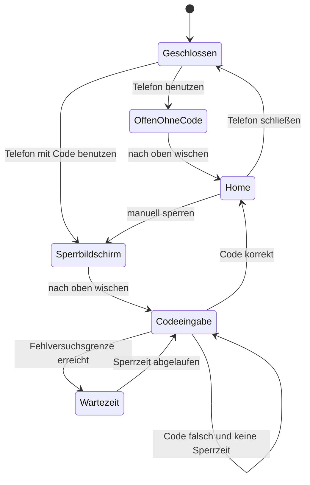

# Geräte-PIN und iPhone-artiger Entsperrfluss

## Ergebnis der Bestandsaufnahme

Eine Geräte-PIN ist noch nicht implementiert.

Vorhanden sind:

- ein visueller Lock Screen in `frontend/src/components/PhoneLockScreen.vue`;
- Sperren bei jedem Öffnen des Telefons in `frontend/src/App.vue`;
- direktes Entsperren durch Wischen, Klicken, Enter oder Leertaste;
- eine IMEI als dauerhafte Identität eines übertragbaren Telefons;
- gerätebezogene JSON-Daten in `sky_phone_device_data`;
- eine iOS-artige Einstellungs-App auf Basis von Konsta UI.

Nicht vorhanden sind:

- PIN-Einrichtung oder PIN-Eingabe;
- ein serverseitiger PIN-Hash;
- Fehlversuche, Wartezeiten oder eine gesperrte Serversitzung;
- ein geschützter Bootstrap, der App-Daten erst nach dem Entsperren liefert.

Der aktuelle Lock Screen ist deshalb nur eine visuelle Ebene. Er schützt keine Gerätedaten.

## Produktentscheidung

Die PIN gehört zum physischen Telefon und damit zur IMEI, nicht zum Spieler und nicht zum
iFruit-Account.

Folgen:

- Wird das Telefon weitergegeben oder gestohlen, bleibt seine PIN erhalten.
- SIM-Wechsel, Account-Anmeldung und Account-Abmeldung ändern die PIN nicht.
- Ein Factory Reset entfernt die PIN zusammen mit den lokalen Gerätedaten.
- Die PIN wird niemals im Inventar-Metadatum oder im NUI-Settings-JSON gespeichert.

Die erste Version unterstützt eine vier- oder sechsstellige numerische PIN. Sechs Stellen sind der
Standard. Face ID, Touch ID und alphanumerische Codes gehören nicht in die erste Version, weil im
Spiel keine vertrauenswürdige biometrische Identität vorhanden ist.

## Orientierung am aktuellen iPhone

Apple führt die Verwaltung unter „Face ID & Code“ beziehungsweise „Touch ID & Code“ und bietet
„Code aktivieren“, „Code ändern“, „Codeoptionen“ und „Code deaktivieren“ an. Da `sky_phone` keine
Biometrie besitzt, heißt der Menüpunkt hier ehrlich **„Code & Sicherheit“**. Der Ablauf bleibt
iPhone-artig:

1. „Code aktivieren“ öffnen.
2. Sechsstelligen Code eingeben.
3. Code zur Bestätigung erneut eingeben.
4. Optional über „Codeoptionen“ auf vier Stellen wechseln.
5. Zum Ändern oder Deaktivieren zuerst den aktuellen Code bestätigen.

Quelle: [Apple – Code auf dem iPhone festlegen](https://support.apple.com/de-de/guide/iphone/iph14a867ae/ios)

## Zielzustände



Beim erneuten Öffnen des Telefons entsteht immer eine neue gesperrte Sitzung. Eine vorherige
Entsperrung darf nach `device:close`, Spieler-Disconnect oder Resource-Neustart nicht fortbestehen.

## Bedienung

### Lock Screen

- Ohne eingerichtete PIN bleibt das bestehende direkte Entsperren erhalten.
- Mit PIN schiebt der Swipe den Lock Screen nach oben und zeigt die Codeeingabe.
- Die Codeeingabe hat sechs beziehungsweise vier Punkte, einen großen 3×4-Zahlenblock und
  „Abbrechen“.
- Sobald alle Stellen eingegeben sind, wird automatisch geprüft.
- Bei falscher PIN: kurze horizontale Shake-Animation, Punkte leeren, lokalisierte Fehlermeldung.
- Bei Wartezeit: Zahlenblock deaktivieren und verbleibende Zeit anzeigen.
- Escape aus der Codeeingabe kehrt zum Lock Screen zurück; Escape schließt nicht unbemerkt die
  Sicherheitsprüfung ab.

Der Zahlenblock ist produktbezogener Inhalt ohne passendes Konsta-Formular. Er bleibt innerhalb der
Konsta-App-Struktur; Dialoge, Listen, Buttons, Toasts und Settings-Zeilen verwenden weiter Konsta UI.

### Einstellungen

Auf der Root-Seite erscheint eine Zeile mit `KeyRound`:

- Titel: „Code & Sicherheit“
- Status rechts: „Ein“ oder „Aus“

Ansicht ohne PIN:

- Erklärung, dass der Code dieses Telefon schützt;
- `kListButton`: „Code aktivieren“;
- Codeoptionen im Einrichtungsablauf: „6-stelliger Code“ und „4-stelliger Code“.

Ansicht mit PIN:

- Vor Anzeige der Verwaltungsoptionen aktuellen Code eingeben;
- `kListButton`: „Code ändern“;
- roter `kListButton`: „Code deaktivieren“;
- optional später: „Daten löschen“ nach zehn Fehlversuchen, standardmäßig deaktiviert.

## Datenmodell

Sensible Daten erhalten eine eigene Tabelle und werden nie durch `load_device_data()` an die NUI
gesendet:

```sql
CREATE TABLE `sky_phone_device_security` (
    `device_imei` CHAR(15) CHARACTER SET ascii COLLATE ascii_bin NOT NULL,
    `passcode_hash` CHAR(64) CHARACTER SET ascii COLLATE ascii_bin NOT NULL,
    `passcode_salt` CHAR(32) CHARACTER SET ascii COLLATE ascii_bin NOT NULL,
    `passcode_length` TINYINT UNSIGNED NOT NULL,
    `failed_attempts` TINYINT UNSIGNED NOT NULL DEFAULT 0,
    `locked_until` DATETIME NULL,
    `updated_at` DATETIME NOT NULL DEFAULT CURRENT_TIMESTAMP ON UPDATE CURRENT_TIMESTAMP,
    PRIMARY KEY (`device_imei`),
    FOREIGN KEY (`device_imei`) REFERENCES `sky_phone_devices` (`imei`) ON DELETE CASCADE
);
```

`install.sql` und `db_migrate.lua` müssen dieselbe Migration enthalten.

Der Hash wird serverseitig aus Salt, PIN und einem nur in der Serverkonfiguration vorhandenen
Pepper gebildet. Der Pepper wird über einen Resource-Convar gelesen, niemals committed oder an den
Client übertragen. Bei aktivierter PIN-Funktion muss ein fehlender Pepper den Start sichtbar
abbrechen. Weder Klartext-PIN noch Hash dürfen geloggt werden.

## Serverautorisierung

Die Serversitzung erhält zusätzlich:

```lua
sessions[source] = {
    imei = imei,
    slot = slot,
    token = token,
    unlocked = not passcode_enabled,
}
```

Es werden zwei Prüfungen benötigt:

- `RequireSession(source)`: Telefon ist offen und befindet sich noch im Inventar.
- `RequireUnlockedSession(source)`: zusätzlich ist diese konkrete Sitzung entsperrt.

Alle App-Daten und zustandsändernden Phone-Callbacks verwenden die zweite Prüfung. Öffentlich im
gesperrten Zustand bleiben nur die eng begrenzten Endpunkte für Entsperren, Schließen,
Lock-Screen-Kamera sowie Anruf annehmen/ablehnen/auflegen.

### Callbacks

- `sky_phone:security:unlock` – PIN prüfen und Sitzung entsperren;
- `sky_phone:security:set-passcode` – erste PIN setzen;
- `sky_phone:security:change-passcode` – aktuellen und neuen Code prüfen;
- `sky_phone:security:disable-passcode` – aktuellen Code prüfen und Datensatz löschen;
- `sky_phone:security:reauthenticate` – Settings-Verwaltung kurzfristig freigeben.

Jeder Endpunkt validiert Typ, Länge, ausschließlich numerische Zeichen, Sitzung, IMEI und Rate
Limit serverseitig. Der Client entscheidet nie selbst, ob eine PIN korrekt ist.

## Geschützter Bootstrap

Der bisherige Bootstrap liefert bereits beim Öffnen Account, Notizen und sämtliche Device-
Namespaces. Das würde einen rein visuellen Lock Screen weiterhin umgehbar machen.

Empfohlener Ablauf:

1. Server öffnet eine gesperrte Sitzung.
2. Bei vorhandener PIN sendet er nur Sprache, Locale, IMEI, Gerätename, sichere Lock-Screen-
   Darstellung und `passcodeEnabled/passcodeLength`.
3. NUI zeigt den Lock Screen; App-Stores werden noch nicht geladen.
4. `security:unlock` prüft die PIN.
5. Bei Erfolg setzt der Server `session.unlocked = true` und liefert den vollständigen Bootstrap.
6. Erst danach laden Mail, Nachrichten, Kontakte, Notizen und andere Apps ihre Daten.

Ohne PIN kann der vollständige Bootstrap wie bisher direkt erfolgen.

## Fehlversuche und Sperrzeiten

Fehlversuche werden pro IMEI persistiert, damit Schließen oder Weitergeben des Telefons sie nicht
zurücksetzt. Empfohlene Staffelung:

- Versuche 1–4: sofort erneut möglich;
- Versuch 5: 30 Sekunden;
- Versuch 6: 1 Minute;
- Versuch 7: 5 Minuten;
- Versuch 8: 15 Minuten;
- ab Versuch 9: 60 Minuten.

Eine erfolgreiche Eingabe setzt Zähler und Sperrzeit zurück. Zusätzlich gilt ein kurzer
serverseitiger Request-Cooldown gegen Callback-Spam.

Automatisches Löschen nach zehn Fehlversuchen wird in Version 1 nicht aktiviert. Diese destruktive
Funktion braucht später eine eigene Config-Option und eine deutliche Warnung.

## Sonderfälle

- **Eingehender Anruf:** Darf beantwortet oder abgelehnt werden, entsperrt aber nicht das Telefon.
  Nach Gesprächsende erscheint wieder der Lock Screen.
- **Kamera-Shortcut:** Öffnet einen eingeschränkten Kameramodus, aber nicht Home Screen oder alte
  Galerieinhalte. Verlassen der Kamera kehrt zum Lock Screen zurück.
- **Benachrichtigungen:** Bleiben sichtbar; deren Inhaltsvorschau kann später separat konfiguriert
  werden.
- **Factory Reset:** Löscht den Security-Datensatz in derselben Transaktion wie die lokalen Daten.
- **Account-Abmeldung:** Verändert die Geräte-PIN nicht.
- **SIM-Wechsel:** Verändert die Geräte-PIN nicht.
- **Resource-Neustart:** Alle In-Memory-Entsperrungen gehen verloren.
- **Vergessene PIN:** In Version 1 nur Factory Reset. Ein iFruit-Account darf die PIN nicht umgehen,
  da Telefon und Account bewusst getrennte Domänen sind.

## Geplante Dateien

Backend und Schema:

- `sky_phone/sql/install.sql`
- `sky_phone/source/server/db_migrate.lua`
- `sky_phone/source/server/phone.lua`
- optional fokussiert: `sky_phone/source/server/security.lua`
- `sky_phone/config/config.lua`

Client und NUI:

- `sky_phone/source/client/main.lua`
- `frontend/src/types/device.ts`
- `frontend/src/stores/phone.ts`
- `frontend/src/App.vue`
- `frontend/src/components/PhoneLockScreen.vue`
- neu: `frontend/src/components/PhonePasscode.vue`
- `frontend/src/views/apps/SettingsApp.vue`
- `sky_phone/config/locales/de.lua`
- `sky_phone/config/locales/en.lua`

Tests:

- Parser/Bootstrap-Tests für PIN an/aus;
- Lock-Screen-State-Test: Swipe ohne Code und Swipe mit Code;
- PIN-Komponententest für Eingabe, Löschen, Bestätigen und Wartezeit;
- Servertests beziehungsweise testbare Funktionen für Validierung und Lockout-Staffel;
- Integrationstest für Telefontransfer, SIM-Wechsel, Account-Abmeldung und Factory Reset;
- Test, dass ein gesperrter Client keine geschützten Callbacks ausführen kann;
- Test, dass ein angenommener Anruf die Gerätesitzung nicht entsperrt.

## Empfohlene Umsetzungsschritte

1. Schema, Pepper-Konfiguration und serverseitigen Security-Service erstellen.
2. Session-Gate und reduzierten Bootstrap einführen.
3. PIN-Zahlenblock und Lock-Screen-Zustandsmaschine umsetzen.
4. „Code & Sicherheit“ in Settings mit Aktivieren/Ändern/Deaktivieren ergänzen.
5. Anruf- und Kamera-Sonderpfade absichern.
6. Lokalisierungen, Testserver-Mocks und Tests ergänzen.
7. Frontend bauen, lokale Deployment-Schritte ausführen und in FiveM testen.

## Abnahmekriterien

- Ein Telefon ohne PIN verhält sich weiterhin wie bisher.
- Eine eingerichtete PIN bleibt an der IMEI hängen und überlebt Spieler- sowie SIM-Wechsel.
- Die PIN ist weder in NUI-Daten noch in Inventar-Metadaten, Logs oder Klartext-Datenbankfeldern
  sichtbar.
- Bei vorhandener PIN gelangen vor erfolgreicher Prüfung keine geschützten App-Daten zum Client.
- Falsche Eingaben erzeugen persistente, serverautorisierte Sperrzeiten.
- Eingehende Anrufe und Lock-Screen-Kamera entsperren das Telefon nicht.
- Ändern und Deaktivieren verlangen den aktuellen Code.
- Factory Reset entfernt die PIN; Account-Abmeldung und SIM-Wechsel tun es nicht.
- Alle Texte sind auf Deutsch und Englisch lokalisiert und alle passenden Settings-Elemente nutzen
  Konsta UI.
